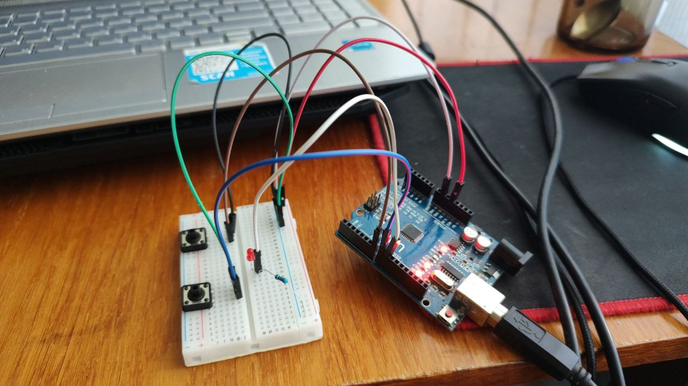

# LEDBlink

## Overview
This project demonstrates a simple Arduino-based system that controls an LED's state using two pushbuttons and a Python script for serial communication. The LED can be turned on, off, or made to blink at different intervals based on input from the buttons or the Python script.

## Hardware Requirements
- Arduino board (e.g., Arduino Uno)
- Breadboard
- Two pushbuttons
- One LED
- Jumper wires
- 220-330 ohm resistor (for LED)
- USB cable (for connecting Arduino to computer)

## Wiring
- Connect the LED anode to digital pin 8 and cathode to GND via a resistor.
- Connect the first pushbutton between digital pin 6 and GND (with an internal pull-up resistor enabled).
- Connect the second pushbutton between digital pin 7 and GND (with an internal pull-up resistor enabled).
- Ensure the Arduino is connected to your computer via USB.

## Software Requirements
- Arduino IDE (for uploading the sketch)
- Python 3.x (with `pyserial` library installed)
- Operating system with terminal support (Windows, macOS, or Linux)

## Installation
1. **Arduino Sketch:**
   - Open `knopkaregum.ino` in the Arduino IDE.
   - Select your Arduino board and port under Tools > Board and Tools > Port.
   - Upload the sketch to the Arduino.

2. **Python Script:**
   - Install the `pyserial` library by running `pip install pyserial` in your terminal or command prompt.
   - Save `main.py` to your computer.
   - Ensure the Arduino is connected and the correct serial port is detected (automatically handled by the script).

## Schematic

Below is a textual representation of the circuit:

- **Pushbutton 1**: Connected between Arduino Pin 6 and GND (with internal pull-up resistor).
- **Pushbutton 2**: Connected between Arduino Pin 7 and GND (with internal pull-up resistor).
- **LED**: Anode to Arduino Pin 8, cathode to GND through a 220-330 ohm resistor.
- **Power**: The circuit uses the Arduino's 5V and GND pins for power.

## Usage
1. Run the Python script (`main.py`) from your terminal or IDE.
2. The script will list available serial ports and connect to the first detected Arduino port at 9600 baud.
3. Enter a mode to control the LED:
   - `0`: Turn LED off
   - `1`: Turn LED on
   - `2`: Blink LED every 200ms
   - `3`: Blink LED every 400ms
   - `+`: Increment mode (cycles 0 → 1 → 2 → 3)
   - `-`: Decrement mode (cycles 3 → 2 → 1 → 0)
   - `q`: Quit the script
4. Alternatively, use the pushbuttons:
   - First button (pin 6): Increment mode
   - Second button (pin 7): Decrement mode

## How It Works
- The Arduino sketch reads input from the serial port (controlled by the Python script) or the pushbuttons.
- The LED state is updated based on the current mode (`val`):
  - `0`: LED off
  - `1`: LED on
  - `2`: Blink at 200ms interval
  - `3`: Blink at 400ms interval
- The Python script sends commands via the serial port and clears the terminal for a clean interface.

## Troubleshooting
- Ensure the correct serial port is selected if the Python script fails to connect.
- Check wiring connections if the LED or buttons do not respond.
- Verify the baud rate (9600) matches between the Arduino sketch and Python script.

## License
This project is open-source. Feel free to modify and distribute it as needed.